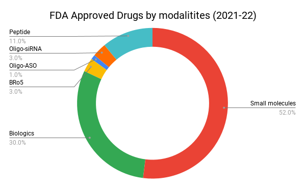

# Introduction aux petites molécules

En pharmacologie, un médicament est une substance chimique qui, lorsqu'elle est administrée à un organisme vivant, produit un effet biologique. Il existe deux principales familles de médicaments : les molécules biologiques (extraites ou produites par un organisme biologique) et les “petites molécules” (synthétique). C’est à cette dernière catégorie, regroupant des molécules ayant une taille comprise entre la dizaine et la centaine d’atomes, qu’appartiennent la majorité des médicaments mis sur le marché chaque année, même si la part des autres familles de médicaments augmente au cours du temps. Parmi les médicaments à petite molécule les plus connus on retrouve par exemple le paracétamol ou l’ibuprofène.

